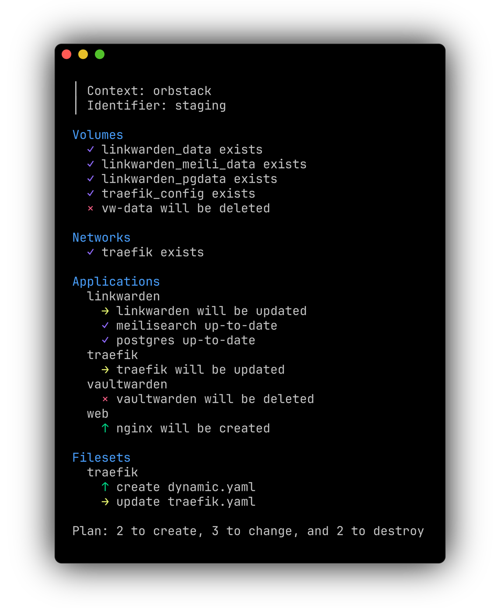

<p align="center">
  <br/>
  <picture>
    <source srcset="logo_light.svg" media="(prefers-color-scheme: light)" width="100"/>
    <source srcset="logo_dark.svg"  media="(prefers-color-scheme: dark)" width="100"/>
    
  </picture>
  <br/>
  
  <br/>
  
</p>

# Dockform

Dockform is a thin layer on top of docker compose for declarative configurations.  
Manage volumes, network, secrets, and even configuration files in a fully declarative way.

The state is defined in a single manifest file:

```yaml
docker:
  context: orbstack
  identifier: staging

environment:
  inline:
    - GLOBAL_VAR=value
    - ENVIRONMENT=production

sops:
  age:
    key_file: ${AGE_KEY_FILE}

applications:
  traefik:
    root: traefik
  linkwarden:
    root: linkwarden
    secrets:
      sops:
        - secrets.env
  vaultwarden:
    root: vaultwarden
  web:
    root: web

networks:
  traefik:

volumes:
  vw-data:
  linkwarden_pgdata:
  linkwarden_data:
  linkwarden_meili_data:

filesets:
  traefik:
    source: traefik/config
    target_volume: traefik_config
    target_path: /etc/traefik
    restart_services:
      - traefik
    exclude:
      - "**/.DS_Store"
```

## Docs

Please visit https://dockform.io for the full documentation.

## Features

- Declarative configuration in a single YAML file
- Idempotent operations
- Transparent config files management
- Git-friendly secrets 
- Unobtrusive and familiar workflow

## Install

### From source
```sh
go build ./cmd/dockform
```

This produces a `dockform` binary in the repo root. Move it to any folder in `$PATH` to use it.

### Go

```sh
go install github.com/gcstr/dockform@latest
```

### Homebrew

```sh
brew tap dockform/tap
brew install dockform
```

Also, precompiled binaries available at the [releases](https://github.com/gcstr/dockform/releases) page.

### Quick Start

You can bootstrap a new Dockform project using the init command:

```sh
dockform init
```

This will create a new manifest file in the current folder based on the default template.  

Plan

```sh
dockform plan
```

And finally, apply the state to your docker daemon

```sh
dockform apply 
```
