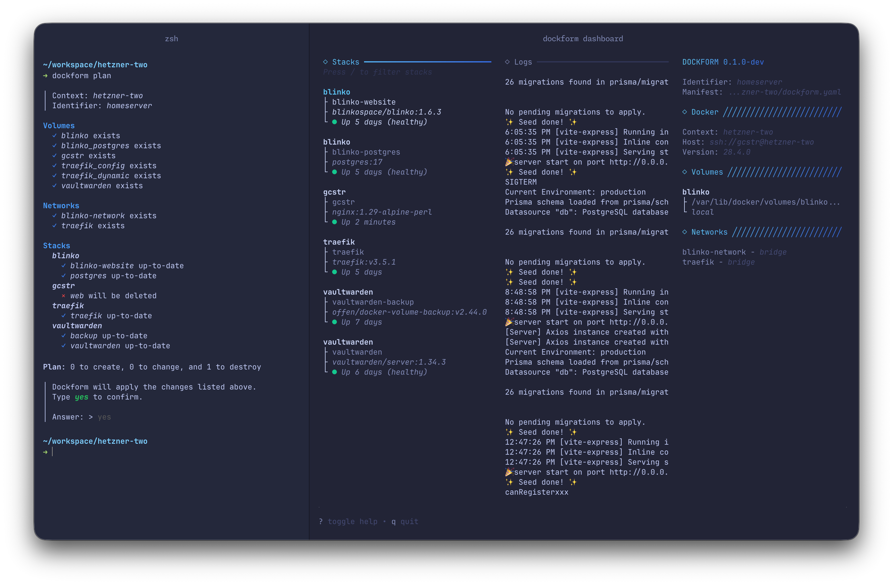

<p align="center">
  <br/>
  <picture>
    <source srcset="logo_light.svg" media="(prefers-color-scheme: light)" width="100"/>
    <source srcset="logo_dark.svg"  media="(prefers-color-scheme: dark)" width="100"/>
    
  </picture>
  <br/>
  
  <br/>
  <a href="https://github.com/gcstr/dockform/blob/main/LICENSE"></a>
  &nbsp;
  <a href="https://github.com/gcstr/dockform/releases/latest"></a>
  &nbsp;
  <a href="https://dockform.io"></a>
  &nbsp;
  
</p>

# Dockform

Dockform is a thin layer on top of Docker Compose for declarative configurations.
Manage volumes, secrets, and configuration files across one or more Docker daemons in a fully declarative way.

With **automatic discovery**, stacks and filesets are found from your directory structure — a minimal manifest is all you need:

```yaml
identifier: homeserver

sops:
  age:
    key_file: ${AGE_KEY_FILE}

contexts:
  hetzner-one: {}
```

```
project/
├── dockform.yaml
└── hetzner-one/
    ├── traefik/
    │   ├── compose.yaml
    │   ├── secrets.env         # Auto-discovered SOPS secrets
    │   └── volumes/
    │       └── config/         # Auto-discovered fileset
    ├── linkwarden/
    │   └── compose.yaml
    └── web/
        └── compose.yaml
```

You can augment discovered stacks when needed:

```yaml
identifier: homeserver

sops:
  age:
    key_file: ${AGE_KEY_FILE}

contexts:
  hetzner-one: {}

stacks:
  hetzner-one/traefik:
    profiles: [production]
  hetzner-one/linkwarden:
    secrets:
      sops:
        - secrets.env
```

## Docs

Please visit https://dockform.io for the full documentation.

## Features

- Declarative configuration in a single YAML file
- Multi-context support for managing multiple Docker hosts
- Automatic discovery of stacks and filesets from directory structure
- Targeted operations (`--context`, `--stack`, `--deployment`)
- Parallel execution across contexts
- Fileset sync with ownership, permissions, and exclusions
- Volume snapshots and restore
- Terminal dashboard for live container monitoring
- Idempotent operations
- Git-friendly secrets via SOPS

## Install

### Homebrew

```sh
brew tap gcstr/dockform
brew install dockform
```

### Go

```sh
go install github.com/gcstr/dockform@latest
```

### From source

```sh
go build ./cmd/dockform
```

Precompiled binaries are also available on the [releases](https://github.com/gcstr/dockform/releases) page.

### Quick Start

Bootstrap a new Dockform project:

```sh
dockform init
```

Preview what will change:

```sh
dockform plan
```

Apply the state to your Docker daemon(s):

```sh
dockform apply
```

Target specific stacks or contexts:

```sh
dockform apply --stack hetzner-one/traefik
dockform apply --context production
```

---

## Why not X?

There are many tools that can help manage containers and deployments, and each solves different problems in different ways. Dockform does **not** try to replace them all. Instead, it focuses on solving **one specific problem**:
**Docker Compose-based deployments across one or more servers**, in a way that is structured, declarative, and ergonomic.

> Dockform never modifies your existing Docker Compose files. Instead, it works alongside them, adding support for things that are usually left to ad-hoc scripts and manual commands — like managing secrets, configs, networks, and volumes — in a way that's Git-friendly and predictable.

### Orchestrators (Kubernetes, Nomad, Swarm, etc.)

Orchestrators are powerful and mature solutions. Kubernetes in particular has become the industry standard. These tools shine in **multi-node, distributed, and highly available environments**.

But they are overkill when you just want to deploy a few containers to one or a handful of machines. Dockform is not an orchestrator: it deliberately avoids the complexity of cluster scheduling and orchestration. Instead, it supports **Compose-based deployments across multiple Docker contexts**, where simplicity and speed matter more than cluster-level resilience.

### Portainer, Dockage, and similar platforms

GUI platforms like **Portainer**, **Dockage**, and others make it easy to manage Compose deployments through a point-and-click interface. They are mature, widely used, and a good fit if you prefer managing your stack visually. Some of them even offer YAML import/export, but their workflows remain primarily GUI-driven rather than Git-first.

Dockform, however, is designed for those who want:

* A **declarative workflow**, expressed in code
* **Git-friendly** configuration and secrets management
* Predictability and reproducibility without relying on manual clicks

If you value infrastructure-as-code, Dockform covers this use case in a way GUI tools do not.

### Pure Docker Compose

Docker Compose itself is already **mostly declarative** and is often "good enough." But when you go beyond a single stack, gaps appear:

* Config files, secrets, external networks, and volume lifecycles often require **imperative commands**
* Ad-hoc shell scripts may fill the gap, but they are **project-specific** and rarely reusable
* Multi-project environments quickly become unstructured and error-prone

Dockform builds on top of Compose to provide **ergonomic structure** for these "surrounding" concerns, without forcing you into a completely new toolchain.

### Ansible, Chef, etc.

Configuration management tools like **Ansible**, **Chef**, or **Puppet** are mature and extremely flexible. They can manage servers, applications, and infrastructure at large scale. But:

* They are **general-purpose** and not specialized for Docker Compose deployments
* While they can be run repeatedly to enforce state, they treat Compose as "just another file" rather than a first-class target
* They require significant setup and boilerplate for what may be a relatively simple Compose-based stack

Dockform focuses on being **Compose-native**, managing only what is relevant to container-based deployments, with less overhead and more ergonomic defaults.

### Dockform

Dockform is not a one-size-fits-all solution. It's designed for a narrow but common scenario: **Compose-based deployments that need structure and reproducibility**, whether on a single server or across multiple Docker hosts.

Dockform is probably **not a good fit** if your project:

* Needs orchestrator-level features (replicas, autoscaling, service discovery)
* Doesn't use Docker Compose as a base
* Relies heavily on GUI-driven management instead of code
* Needs advanced networking topologies outside the Compose model

If those apply, tools like Kubernetes, Nomad, Swarm, or Portainer are probably a better fit.

## Project Structure

```
internal/
├── cli/          # Command interface (Cobra-based)
├── planner/      # Core business logic (plan-apply workflow)
├── dockercli/    # Docker operations abstraction
├── manifest/     # Configuration parsing & validation
├── apperr/       # Structured error handling
├── filesets/     # File synchronization logic
├── secrets/      # SOPS integration
├── ui/           # User interface components
└── util/         # Shared utilities
```
